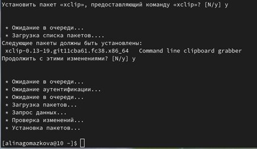
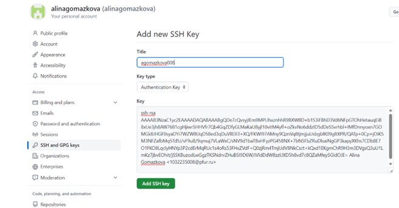
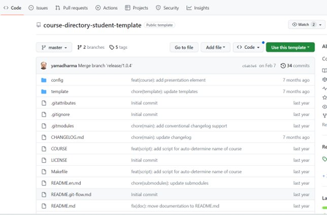
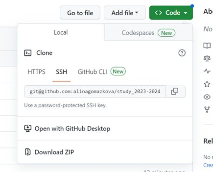

---
## Front matter
title: "Отчёт по лабораторной работе №2"
subtitle: "Дисциплина: архитектура компьютера"
author: "Гомазкова Алина"

## Generic otions
lang: ru-RU
toc-title: "Содержание"

## Bibliography
bibliography: bib/cite.bib
csl: pandoc/csl/gost-r-7-0-5-2008-numeric.csl

## Pdf output format
toc: true # Table of contents
toc-depth: 2
lof: true # List of figures
lot: true # List of tables
fontsize: 12pt
linestretch: 1.5
papersize: a4
documentclass: scrreprt
## I18n polyglossia
polyglossia-lang:
  name: russian
  options:
	- spelling=modern
	- babelshorthands=true
polyglossia-otherlangs:
  name: english
## I18n babel
babel-lang: russian
babel-otherlangs: english
## Fonts
mainfont: PT Serif
romanfont: PT Serif
sansfont: PT Sans
monofont: PT Mono
mainfontoptions: Ligatures=TeX
romanfontoptions: Ligatures=TeX
sansfontoptions: Ligatures=TeX,Scale=MatchLowercase
monofontoptions: Scale=MatchLowercase,Scale=0.9
## Biblatex
biblatex: true
biblio-style: "gost-numeric"
biblatexoptions:
  - parentracker=true
  - backend=biber
  - hyperref=auto
  - language=auto
  - autolang=other*
  - citestyle=gost-numeric
## Pandoc-crossref LaTeX customization
figureTitle: "Рис."
tableTitle: "Таблица"
listingTitle: "Листинг"
lofTitle: "Список иллюстраций"
lotTitle: "Список таблиц"
lolTitle: "Листинги"
## Misc options
indent: true
header-includes:
  - \usepackage{indentfirst}
  - \usepackage{float} # keep figures where there are in the text
  - \floatplacement{figure}{H} # keep figures where there are in the text
---

# Цель работы
Целью данной работы является изучить идеологию и применение средств контроля версий, а также приобрести практические навыки по работе с системой git.

# Задание 
1. Настройка GitHub.
2. Базовая настройка Git.
3. Создание SSH-ключа.
4. Создание рабочего пространства и репозитория курса на основе шаблона.
5. Создание репозитория курса на основе шаблона.
6. Настройка каталога курса.
7. Выполнение заданий для самостоятельной работы.

# Теоретическое введение
Системы контроля версий (Version Control System, VCS) применяются при работе нескольких человек над одним проектом. Обычно основное дерево проекта хранится в локальном или удалённом репозитории, к которому настроен доступ для участников проекта. При внесении изменений в содержание проекта система контроля версий позволяет их фиксировать, совмещать изменения, произведённые разными участниками проекта, производить откат к любой более ранней версии проекта, если это требуется. В классических системах контроля версий используется централизованная модель, предполагающая наличие единого репозитория для хранения файлов. Выполнение большинства функций по управлению версиями осуществляется специальным сервером. Участник проекта (пользователь) перед началом работы посредством определённых команд получает нужную ему версию файлов. После внесения изменений пользователь размещает новую версию в хранилище. При этом предыдущие версии не удаляются из центрального хранилища и к ним можно вернуться в любой момент. Сервер может сохранять не полную версию изменённых файлов, а производить так называемую дельта-компрессию — сохранять только изменения между последовательными версиями, что позволяет уменьшить объём хранимых данных. Системы контроля версий поддерживают возможность отслеживания и разрешения конфликтов, которые могут возникнуть при работе нескольких человек над одним файлом. Можно объединить изменения, сделанные разными участниками, вручную выбрать нужную версию, отменить изменения вовсе или заблокировать файлы для изменения. В зависимости от настроек блокировка не позволяет другим пользователям получить рабочую копию или препятствует изменению рабочей копии файла средствами файловой системы ОС, обеспечивая таким образом привилегированный доступ только одному пользователю, работающему с файлом. Системы контроля версий также могут обеспечивать дополнительные, более гибкие функциональные возможности. Например, они могут поддерживать работу с несколькими версиями одного файла, сохраняя общую историю изменений до точки ветвления версий и собственные истории изменений каждой ветви. Обычно доступна информация о том, кто из участников, когда и какие изменения вносил. Обычно такого рода информация хранится в журнале изменений, доступ к которому можно ограничить. В отличие от классических, в распределённых системах контроля версий центральный репозиторий не является обязательным. Среди классических VCS наиболее известны CVS, Subversion, а среди распределённых — Git, Bazaar, Mercurial. Принципы их работы схожи, отличаются они в основном синтаксисом используемых в работе команд. Система контроля версий Git представляет собой набор программ командной строки. Доступ к ним можно получить из терминала посредством ввода команды git с различными опциями. Благодаря тому, что Git является распределённой системой контроля версий, резервную копию локального хранилища можно сделать простым копированием или архивацией. Работа пользователя со своей веткой начинается с проверки и получения изменений из центрального репозитория (при этом в локальное дерево до начала этой процедуры не должно было вноситься изменений). Затем можно вносить изменения в локальном дереве и/или ветке. После завершения внесения какого-то изменения в файлы и/или каталоги проекта необходимо разместить их в центральном репозитории.

# Выполнение лабораторной работы

## Настройка GitHub

Создаю учетную запись на сайте GitHub.Далее я заполнила основные данные учетной записи (рис.[-@fig:001]).
{#fig:001 width=70%}

Аккаунт создан (рис. [-@fig:002]).
{#fig:002 width=70%}

## Базовая настройка Git

Открываю виртуальную машину, затем открываю терминал и делаю предварительную конфигурацию git. Ввожу команду git config –global user.name “”, указывая свое имя и команду git config –global user.email “work@mail”, указывая в ней электронную почту владельца, то есть мою (рис.[-@fig:003]).
{#fig:003 width=70%}

Настраиваю utf-8 в выводе сообщений git для корректного отображения символов (рис.[-@fig:004]).
{#fig:004 width=70%}

Задаю имя «master» для начальной ветки (рис.[-@fig:005]).
{#fig:005 width=70%}

Задаю параметр autocrlf со значением input, так как я работаю в системе Linux, чтобы конвертировать CRLF в LF только при коммитах. CR и LF – это символы, которые можно использовать для обозначения разрыва строки в текстовых файлах (рис.[-@fig:006]).
{#fig:006 width=70%}

Задаю параметр safecrlf со значением warn, так Git будет проверять преобразование на обратимость. При значении warn Git только выведет предупреждение, но будет принимать необратимые конвертации (рис.[-@fig:007]).
{#fig:007 width=70%}

## Создание SSH-ключа

Для последующей идентификации пользователя на сервере репозиториев необходимо сгенерировать пару ключей (приватный и открытый). Для этого ввожу команду ssh-keygen -C “Имя Фамилия, work@email”, указывая имя владельца и электронную почту владельца. Ключ автоматически сохранится в каталоге ~/.ssh/ (рис.[-@fig:008]).
[Генерация SSH-ключа](image/8.jpg){#fig:008 width=70%}

Xclip – утилита, позволяющая скопировать любой текст через терминал. Оказывается, в дистрибутиве Linux Kali ее сначала надо установить. Устанавливаю xclip с помощью команды apt-get install с ключом -y отимени суперпользователя, введя в начале команды sudo (рис.[-@fig:009]).
{#fig:009 width=70%}

Копирую открытый ключ из директории, в которой он был сохранен, с помощью утилиты xclip (рис.[-@fig:010]).
{#fig:010 width=70%}

Открываю браузер, захожу на сайт GitHub. Открываю свой профиль и выбираю страницу «SSH and GPG keys». Нажимаю кнопку «New SSH key». Вставляю скопированный ключ в поле «Key». В поле Title указываю имя для ключа. Нажимаю «Add SSH-key», чтобы завершить добавление ключа (рис.[-@fig:011]).
{#fig:011 width=70%}

## Создание рабочего пространства и репозитория курса на основе шаблона

Закрываю браузер, открываю терминал. Создаю директорию, рабочее пространство, с помощью утилиты mkdir, блягодаря ключу -p создаю все директории после домашней ~/work/study/2022-2023/“Архитектура компьютера” рекурсивно. Далее проверяю с помощью ls, действительно ли были созданы необходимые мне каталоги (рис.[-@fig:012]). 
{#fig:012 width=70%}

## Создание репозитория курса на основе шаблона

В браузере перехожу на страницу репозитория с шаблоном курса по адресу https://github.com/yamadharma/course-directory-student-template. Далее выбираю «Use this template», чтобы использовать этот шаблон для своего репозитория (рис.[-@fig:013]). 
{#fig:013 width=70%}

В открывшемся окне задаю имя репозитория (Repository name): study_2023–2024_arh-pc и создаю репозиторий, нажимаю на кнопку «Create repository from template» (рис.[-@fig:014]). 
{#fig:014 width=70%}

Репозиторий создан (рис.[-@fig:015]).
{#fig:015 width=70%}

Через терминал перехожу в созданный каталог курса с помощью утилиты cd (рис.[-@fig:016]).
{#fig:016 width=70%}

Клонирую созданный репозиторий с помощью команды git clone –recursive git@github.com:/study_2023–2024_arh-pc.git arch-pc (рис.[-@fig:017]).
{#fig:017 width=70%}

Копирую ссылку для клонирования на странице созданного репозитория, сначала перейдя в окно «code», далее выбрав в окне вкладку «SSH» (рис.[-@fig:018]).
{#fig:018 width=70%}

## Настройка каталога курса

Перехожу в каталог arch-pc с помощью утилиты cd (рис.[-@fig:019]).
{#fig:019 width=70%}

Удаляю лишние файлы с помощью утилиты rm (рис.[-@fig:020]).
{#fig:020 width=70%}

Создаю необходимые каталоги (рис.[-@fig:021]).
{#fig:021 width=70%}

Отправляю созданные каталоги с локального репозитория на сервер: добавляю все созданные каталоги с помощью git add, комментирую и сохраняю изменения на сервере как добавление курса с помощью git commit (рис.22.)(рис. @fig:022).
{#fig:022 width=70%}

Отправляю все на сервер с помощью push (рис.[-@fig:023]).
{#fig:023 width=70%}

Проверяю правильность выполнения работы сначала на самом сайте GitHub (рис.[-@fig:024]).
{#fig:024 width=70%}

# Выводы

При выполнении данной лабораторной работы я изучила идеологию и применение средств контроля версий, а также приобрела практические навыки по работе с системой git.

# Список литературы{.unnumbered}

1. https://esystem.rudn.ru/pluginfile.php/2089082/mod_resource/content/0/%D0%9B%D0%B0%D0%B1%D0%BE%D1%80%D0%B0%D1%82%D0%BE%D1%80%D0%BD%D0%B0%D1%8F%20%D1%80%D0%B0%D0%B1%D0%BE%D1%82%D0%B0%20%E2%84%962.%20%D0%A1%D0%B8%D1%81%D1%82%D0%B5%D0%BC%D0%B0%20%D0%BA%D0%BE%D0%BD%D1%82%D1%80%D0%BE%D0%BB%D1%8F%20%D0%B2%D0%B5%D1%80%D1%81%D0%B8%D0%B9%20Git.pdf

