---
## Front matter
title: "Отчёт по лабораторной работе №3"
subtitle: "Дисциплина: архитектура компьютера"
author: "Гомазкова Алина"

## Generic otions
lang: ru-RU
toc-title: "Содержание"

## Bibliography
bibliography: bib/cite.bib
csl: pandoc/csl/gost-r-7-0-5-2008-numeric.csl

## Pdf output format
toc: true # Table of contents
toc-depth: 2
lof: true # List of figures
lot: true # List of tables
fontsize: 12pt
linestretch: 1.5
papersize: a4
documentclass: scrreprt
## I18n polyglossia
polyglossia-lang:
  name: russian
  options:
	- spelling=modern
	- babelshorthands=true
polyglossia-otherlangs:
  name: english
## I18n babel
babel-lang: russian
babel-otherlangs: english
## Fonts
mainfont: PT Serif
romanfont: PT Serif
sansfont: PT Sans
monofont: PT Mono
mainfontoptions: Ligatures=TeX
romanfontoptions: Ligatures=TeX
sansfontoptions: Ligatures=TeX,Scale=MatchLowercase
monofontoptions: Scale=MatchLowercase,Scale=0.9
## Biblatex
biblatex: true
biblio-style: "gost-numeric"
biblatexoptions:
  - parentracker=true
  - backend=biber
  - hyperref=auto
  - language=auto
  - autolang=other*
  - citestyle=gost-numeric
## Pandoc-crossref LaTeX customization
figureTitle: "Рис."
tableTitle: "Таблица"
listingTitle: "Листинг"
lofTitle: "Список иллюстраций"
lotTitle: "Список таблиц"
lolTitle: "Листинги"
## Misc options
indent: true
header-includes:
  - \usepackage{indentfirst}
  - \usepackage{float} # keep figures where there are in the text
  - \floatplacement{figure}{H} # keep figures where there are in the text
---

# Цель работы

Целью работы является освоение процедуры оформления отчетов с помощью легковесного языка разметки Markdown.

# Задание

1.Установка необходимого ПО

2.Заполнение отчета по выполнению лабораторной работы №4 с помощью языка разметки Markdown

3.3адание для самостоятельной работы

# Теоретическое введение

Markdown - легковесный язык разметки, созданный с целью обозначения форматирования в простом тексте, с максимальным сохранением его читаемости человеком, и пригодный для машинного преобразования в языки для продвинутых публикаций. Внутритекстовые формулы делаются аналогично формулам LaTeX. В Markdown вставить изображение в документ можно с помощью непосредственного указания адреса изображения. Синтаксис Markdown для встроенной ссылки состоит из части [link text], представляющей текст гиперссылки, и части (file-name.md) – URL-адреса или имени файла, на который дается ссылка. Markdown поддерживает как встраивание фрагментов кода в предложение, так и их размещение между предложениями в виде отдельных огражденных блоков. Огражденные блоки кода — это простой способ выделить синтаксис для фрагментов кода.

# Выполнение лабораторной работы
## Установление необходимого ПО

### Установка TexLive 

Скачала TexLive с официального сайта. Распаковываю архив. Перехожу в распакованную папку с помощью cd. Запускаю скрипт install-tl-* с правами root, используя sudo в начале команды (рис. 1)

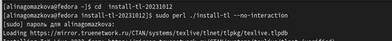{#fig:001 width=70%}

Добавляю /usr/local/texlive/2022/bin/x86_64-linux в свой PATH для текущей и будущих сессий (рис. 2)

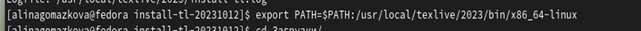{#fig:002 width=70%}

### Установка Pandoc и pandoc-crossref 

Скачиваю архив pandoc версии 3.1.8 (рис. 3)

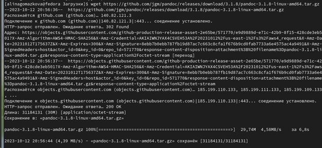{#fig:003 width=70%}

Скачиваю архив pandoc-crossref 0.3.13.0 (рис. 4)

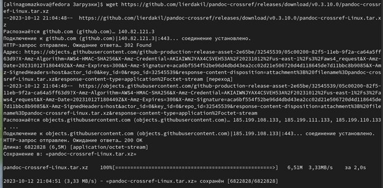{#fig:004 width=70%}

Распаковываю скачанные архивы (рис. 5)

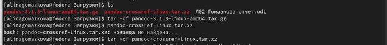{#fig:005 width=70%}

Копирую файлы pandoc и pandoc-crossref в каталог /usr/local/bin/ с правами пользователя root с помощью sudo (рис. 6)

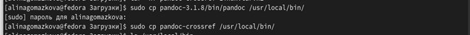{#fig:006 width=70%}

Проверяю корректность выполненных действий (рис. 7)

{#fig:007 width=70%}

# Заполнение отчета по выполнению лабораторной работы №3 с помощью языка разметки Markdown

Открываю терминал. Перехожу в каталог курса, сформированный при выполненнии прошлой лаборатной работы (рис. 8)

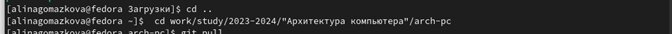{#fig:008 width=70%}

Обновляю локальный репозиторий, скачав изменения из удаленного репозитория с помощью команды git pull (рис. 9)

{#fig:009 width=70%}

Перехожу в каталог с шаблоном отчета по лабораторной работе №3 с помощью cd (рис. 10)

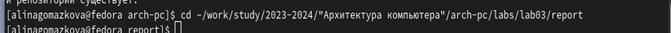{#fig:010 width=70%}

Компилирую шаблон с использованием Makefile, вводя команду make (рис. 11)

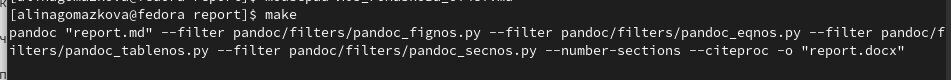{#fig:011 width=70%}

Открываю сгенерированный файл report.docx LibreOffice (рис. 12)

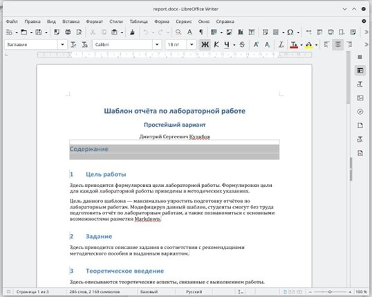{#fig:012 width=70%}

Открываю сгенерированный файл report.pdf. Убедилась, что все правильно сгенерировалось (рис. 13)

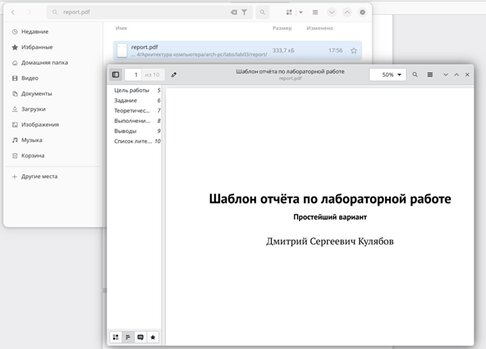{#fig:013 width=70%}

Удаляю полученные файлы с использованием Makefile, вводя команду make clean. С помощью команды ls проверяю, удалились ли созданные файлы (рис. 14)

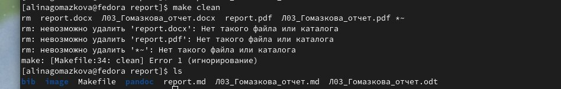{#fig:014 width=70%}

Открываю файл report.md с помощью любого текстового редактора mousepad (рис. 15)

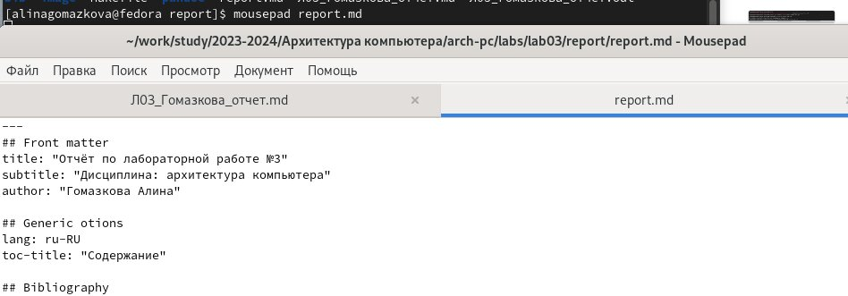{#fig:015 width=70%}

Я хочу, чтобы у меня на всякий случай сохранился шаблон отчета, поэтому копирую файл с новым названием с помощью утилиты cp (рис. 16)

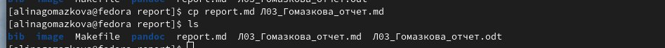{#fig:016 width=70%}

Начинаю заполнять отчет с помощью языка разметки Markdown в скопированном файле (рис. 17)

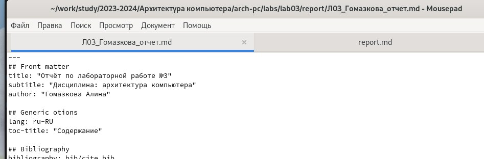{#fig:017 width=70%}

Компилирую файл с отчетом. Загружаю отчет на GitHub.

# Задание для самостоятельной работы

1. Перехожу в директорию lab02/report с помощью cd, чтобы там заполнять отчет по третьей лабораторной работе (рис. 18)

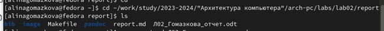{#fig:018 width=70%}

Копирую файл report.md с новым именем для заполненния отчета (рис. 19)

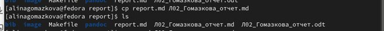{#fig:019 width=70%}

Открываю файл с помощью текстового редактора mousepad и начинаю заполнять отчет (рис. 20)

{#fig:020 width=70%}

Удаляю предыдущий файл отчета, чтобы при компиляции он мне не мешал (рис. 21)

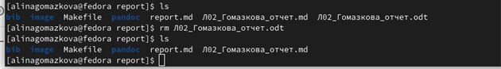{#fig:021 width=70%}

Компилирую файл с отчетом по лабораторной работе (рис. 22)

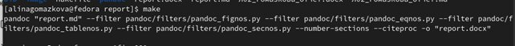{#fig:022 width=70%}

2. Удаляю лишние сгенерированные файлы report.docx и report.pdf (рис. 23)

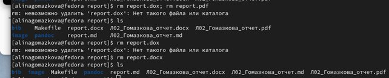{#fig:023 width=70%}

Добавляю изменения на GitHub с помощью комнадой git add и сохраняю изменения с помощью commit (рис. 24)

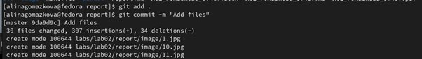{#fig:024 width=70%}

Отправлялю файлы на сервер с помощью команды git pull (рис. 25)

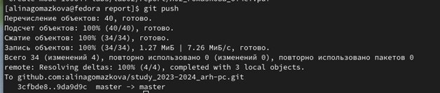{#fig:025 width=70%}

# Выводы

В результате выполнения данной лабораторной работы я освоила процедуры оформления отчетов с помощью легковесного языка разметки Markdown.

# Список литературы{.unnumbered}

1. [Архитектура ЭВМ](https://esystem.rudn.ru/pluginfile.php/2089083/mod_resource/content/0/%D0%9B%D0%B0%D0%B1%D0%BE%D1%80%D0%B0%D1%82%D0%BE%D1%80%D0%BD%D0%B0%D1%8F%20%D1%80%D0%B0%D0%B1%D0%BE%D1%82%D0%B0%20%E2%84%963.%20%D0%AF%D0%B7%D1%8B%D0%BA%20%D1%80%D0%B0%D0%B7%D0%BC%D0%B5%D1%82%D0%BA%D0%B8%20.pdf)

